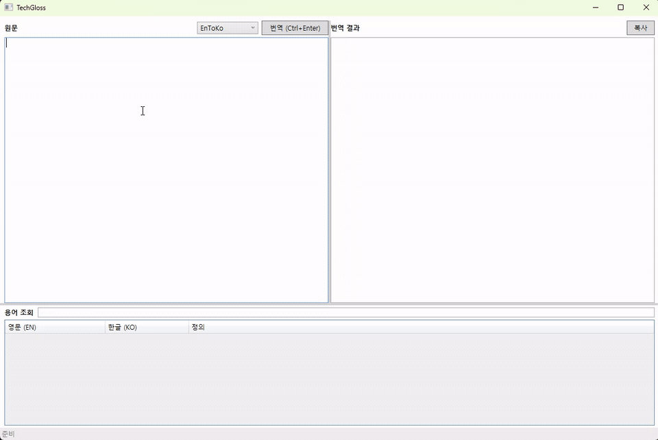

# TechGloss

사내 고정 Ollama LLM과 로컬 Glossary API를 연동한 EN↔KO IT 기술 번역 데스크톱 앱.  
WPF 네이티브 UI(RichTextBox / FlowDocument)로 스트리밍 번역을 실시간 표시하고, 번역 완료 후 용어를 자동 추출해 PostgreSQL + pgvector에 누적합니다.

## GIF 미리보기



## 주요 기능

- **EN↔KO 스트리밍 번역** — Ollama(`gemma4:latest`) NDJSON 스트림을 RichTextBox에 토큰 단위 실시간 append
- **용어 자동 추출** — 번역 완료 후 원문·번역문 쌍을 Ollama로 분석, 단어·구문 레벨 EN/KO 쌍을 DB에 자동 저장
- **실시간 LIKE 검색** — 입력 즉시 SQL LIKE로 용어 조회, ListView 표시
- **RAG 의미 검색** — `nomic-embed-text` 임베딩 + pgvector HNSW 코사인 유사도로 관련 용어 검색
- **카테고리 자동 생성** — LLM이 제안한 카테고리가 없으면 `glossary_category`에 즉시 생성

## 아키텍처

```
WPF (RichTextBox / FlowDocument / MVVM)
    ↕ MainViewModel + TranslationOrchestrator
TechGloss.Infrastructure (HttpClient, SSRF 핸들러, Polly 재시도)
    ├─ OllamaHttpClient      → http://172.20.64.76:11434  (gemma4:latest, NDJSON 스트리밍)
    └─ GlossaryHttpClient    → http://127.0.0.1:5088
                                  TechGloss.GlossaryApi (ASP.NET Core Minimal API)
                                      ├─ PostgreSQL + pgvector
                                      ├─ EmbeddingService   → Ollama nomic-embed-text
                                      └─ TermExtractionService → Ollama gemma4:latest
```

## 기술 스택

| 계층 | 기술 |
|------|------|
| WPF 쉘 | .NET 8 WPF (RichTextBox / FlowDocument / MVVM) |
| Glossary API | ASP.NET Core Minimal API |
| DB | PostgreSQL 16 + pgvector (`pgvector/pgvector:pg16`) |
| ORM | EF Core 9 + Npgsql + EFCore.NamingConventions |
| LLM | Ollama `/api/chat` NDJSON 스트리밍 |
| 임베딩 | Ollama `nomic-embed-text` → vector(768) HNSW |
| HTTP | System.Text.Json, Polly 재시도 |

## 프로젝트 구조

```
TechGloss.sln
Directory.Build.props              # net8.0, Nullable enable, ImplicitUsings
src/
  TechGloss.Core/                  # 도메인 모델·인터페이스 (외부 의존 없음)
  TechGloss.Infrastructure/        # HttpClient 팩토리·설정·SSRF 핸들러
  TechGloss.Wpf/                   # WPF 쉘·RichTextBox UI·ViewModel
  TechGloss.GlossaryApi/           # ASP.NET Core Minimal API + DB
tests/
  TechGloss.Core.Tests/
  TechGloss.GlossaryApi.Tests/
docs/DEPLOY.md
```

## 요구 사항

- .NET 8 SDK
- Docker (PostgreSQL 컨테이너)
- Ollama 서버 (`172.20.64.76:11434`, `gemma4:latest` 및 `nomic-embed-text` 로드 필요)

## 빠른 시작

### 1. PostgreSQL 컨테이너 시작

```bash
docker compose up -d
```

`pgvector/pgvector:pg16` 이미지를 사용합니다.  
GlossaryApi 최초 실행 시 테이블·인덱스·카테고리 시드가 자동 생성됩니다.

### 2. GlossaryApi 실행

```bash
dotnet run --project src/TechGloss.GlossaryApi
```

`http://127.0.0.1:5088/health` 에서 상태 확인:
```json
{"status":"ok","time":"..."}
```

### 3. WPF 앱 실행

```bash
dotnet run --project src/TechGloss.Wpf
```

## GlossaryApi 엔드포인트

| 메서드 | 경로 | 설명 |
|--------|------|------|
| `GET` | `/health` | 헬스 체크 |
| `POST` | `/glossary/search` | pgvector 코사인 유사도 검색 (RAG) |
| `GET` | `/glossary/lookup?q=...&lang=auto` | SQL LIKE 실시간 검색 |
| `POST` | `/glossary/upsert` | 용어 단건 추가/수정 |
| `POST` | `/glossary/publish` | 용어 상태를 `published`로 전환 |
| `POST` | `/glossary/extract-terms` | 번역 텍스트 쌍에서 용어 자동 추출·저장 |

## 용어 자동 추출 흐름

```
번역 완료
  → TranslationOrchestrator.ExtractTermsAfterTranslationAsync()
  → POST /glossary/extract-terms
      → TermExtractionService: Ollama로 EN/KO 단어·구문 쌍 추출 (JSON 배열)
      → 카테고리 없으면 glossary_category 자동 생성 (name_en_normalized 기준 중복 판별)
      → GlossaryEntry INSERT (status = published)
      → EmbeddingService: nomic-embed-text로 벡터 임베딩 저장
```

## DB 스키마

### glossary_entry

| 컬럼 | 타입 | 설명 |
|------|------|------|
| `id` | UUID PK | Qdrant point id와 동일 값 유지 |
| `term_en` / `term_ko` | TEXT | 표시용 원문·번역 |
| `term_en_normalized` / `term_ko_normalized` | TEXT | NFKC+Trim+Lower, 복합 UNIQUE 인덱스 기준 |
| `definition_ko` | TEXT | 한글 정의 |
| `category_id` | UUID FK | glossary_category 참조 |
| `status` | TEXT | `draft` → `published` → `deprecated` |
| `embedding` | vector(768) | nomic-embed-text 임베딩, HNSW 코사인 인덱스 |

### glossary_category

| 컬럼 | 타입 | 설명 |
|------|------|------|
| `id` | UUID PK | |
| `name` | TEXT | 표시용 카테고리명 |
| `name_en_normalized` | TEXT UNIQUE | NFKC+Trim+Lower, 중복 판별 기준 |

## 설정

`src/TechGloss.GlossaryApi/appsettings.json`, `src/TechGloss.Wpf/appsettings.json`

```json
{
  "TechGloss": {
    "Ollama": {
      "BaseUrl": "http://172.20.64.76:11434",
      "Model": "gemma4:latest",
      "EmbeddingModel": "nomic-embed-text",
      "TimeoutSeconds": 120
    },
    "GlossaryApi": {
      "BaseUrl": "http://127.0.0.1:5088",
      "TimeoutSeconds": 180
    }
  }
}
```

`GlossaryApi.TimeoutSeconds`는 내부 Ollama 호출(TermExtraction)을 커버할 수 있도록 `Ollama.TimeoutSeconds`보다 크게 설정합니다.

## 테스트

```bash
# Core 단위 테스트
dotnet test tests/TechGloss.Core.Tests

# GlossaryApi 통합 테스트
dotnet test tests/TechGloss.GlossaryApi.Tests
```

## 보안

- **SSRF 방지** — `AllowedHostsHandler`가 허용 호스트(`172.20.64.76`, `127.0.0.1`) 외 요청을 즉시 차단
- **Polly 재시도** — Ollama 일시적 오류에 지수 백오프 3회 재시도
- `TechGloss.Infrastructure`, `TechGloss.Wpf`에 `Qdrant.Client` 직접 참조 금지 — GlossaryApi 전용
