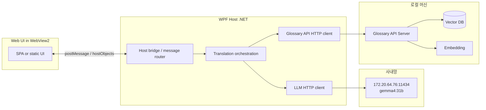
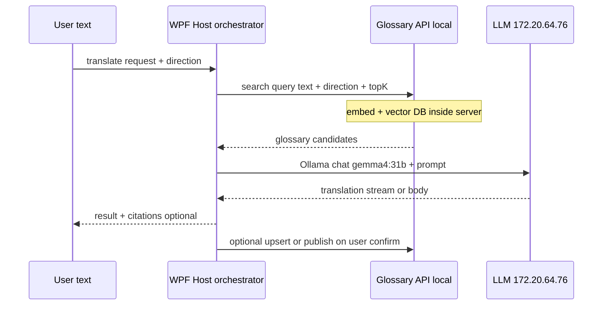
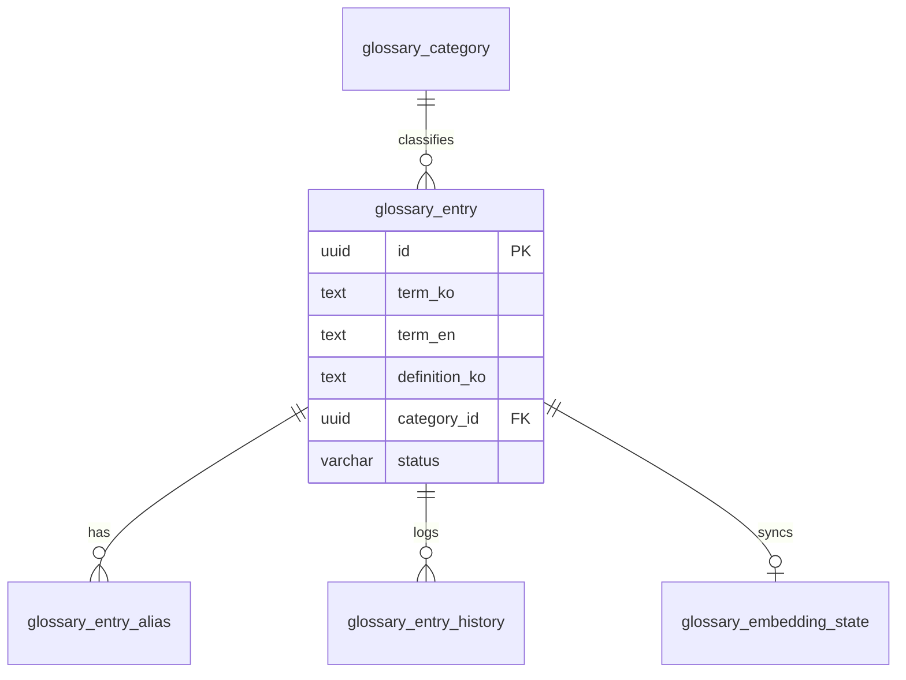

# TechGloss — 한글 IT 기술 번역기 코드 리서치 (Research)

**문서 목적:** WPF 데스크톱 실행 파일 안에서 웹 UI를 표시하고, **사내 고정 LLM 엔드포인트**와 연동하며, 번역 용어는 **로컬 Glossary API 서버**(벡터 DB·임베딩·용어 CRUD)를 통해 정리하는 **TechGloss** 구현을 위한 기술 조사와 권장 아키텍처를 정리한다. **영어(EN)와 한국어(KO) 양방향** IT 기술 문서 번역과 더불어, **번역 이외의 용어 검색(한글·영어, 글자 단위 LIKE)** 으로 정의를 즉시 조회하는 기능을 포함한다.

**대상 독자:** C# / WPF에 익숙하고, LLM API·RAG·벡터 검색 개념을 코드 수준으로 설계하려는 개발자.

**범위:** 데스크톱 셸(WPF), 웹 뷰(WebView2), **고정 LLM**(`172.20.64.76:11434`, 모델 `gemma4:31b`), **로컬 Glossary API 서버**를 통한 임베딩·벡터 저장소·용어 정리·**용어 LIKE 검색 API**, **EN↔KO 양방향** 번역 파이프라인, **IT 기술 번역 가이드라인(프롬프트·품질 기준)**. 구체적인 UI 디자인·제품 기획은 최소화한다.

---

## 1. 요구사항을 엔지니어링 관점으로 풀기

| 사용자 요구 | 기술적 해석 |
|-------------|-------------|
| WPF 형식 exe | .NET(WPF) 프로세스가 메인 윈도우·수명주기·설치·업데이트를 담당 |
| exe 안에서 웹 표시 | **WebView2**(Chromium 기반)로 HTML/CSS/JS 또는 SPA 번들 로드 |
| LLM 연동(고정) | 베이스 URL **`http://172.20.64.76:11434`**, 모델 **`gemma4:31b`** — 포트 기준 **Ollama 호환 HTTP API**로 가정한다(`POST /api/chat` 등). 사내망이면 TLS 없이 HTTP일 수 있으므로 `HttpClient`·방화벽·DNS를 이 주소에 맞춘다. 스트리밍은 Ollama 응답 스트림 처리. |
| 번역 단어·벡터 DB·용어 정리 | WPF는 벡터 DB에 **직접 붙지 않고**, 동일 PC(또는 개발 시 localhost)에서 기동하는 **로컬 Glossary API 서버**에 REST 호출한다. 서버가 임베딩·유사도 검색·용어 저장을 담당하고, 호스트는 **번역 오케스트레이션**(글로서리 조회 → LLM 호출)만 수행한다. |
| **영어 ↔ 한국어 양방향 번역** | 모든 요청에 **`source_lang` / `target_lang`(또는 `direction`)**을 명시하고, 프롬프트·글로서리 조회·로그를 방향에 맞게 전환. 자동 언어 감지는 보조로만 쓰고 UI에서는 방향을 고정할 수 있게 한다 |
| **번역 이외 용어 검색(한·영)** | 전용 검색 UI(또는 사이드 패널)에서 사용자가 **한 글자씩** 입력할 때마다 **Glossary API**가 관계형 DB에 대해 **`LIKE`** 조건으로 `term_ko`, `term_en`, `definition_ko`를 조회하고, 매칭 행의 **`definition_ko`(국문 설명)**·대응 영·국문 용어·카테고리를 화면에 표시한다. 벡터 유사도 검색과 별도 경로로 둔다(§5.7). |

**비목표(초기 단계에서 분리 권장):** 동시 통역 수준의 실시간 음성, 완전 오프라인 LLM, 다중 사용자 서버 동기화(별도 백엔드 설계).

---

## 2. 권장 참조 아키텍처

데스크톱 앱은 **UI(Web) ↔ 호스트(.NET) ↔ 사내 LLM + 로컬 Glossary API** 레이어로 나눈다. 벡터 DB·임베딩은 **Glossary API 서버 프로세스 내부**에 두어 WPF 바이너리와 수명주기·의존성을 분리한다.

### 2.1 확정 엔드포인트(본 문서 기준)

| 구분 | 값·역할 |
|------|---------|
| **LLM** | `http://172.20.64.76:11434` — 모델 **`gemma4:31b`**. 호스트의 `HttpClient`가 이 호스트로만 번역·(선택) 재시도 요청을 보낸다. |
| **Glossary / 벡터·용어** | **로컬 API 서버**(예: ASP.NET Core Minimal API, FastAPI 등)를 별도 프로세스로 기동. 베이스 URL은 설정으로 두되 기본값은 **`http://127.0.0.1` + 포트**(또는 사내 고정 포트). WPF는 **이 API만** 호출해 `search`(벡터 RAG), **`lookup`(글자 단위 LIKE 용어 검색)**, `upsert`, `publish` 등을 수행한다. |



**설계 원칙**

1. **시크릿:** 사내 LLM이 키 없이 동작할 수 있으나, Glossary API에 인증을 둘 경우 호스트(.NET) 또는 OS 저장소에서만 주입하고 웹 콘솔에는 노출하지 않는다.
2. **WPF는 벡터 DB에 직접 연결하지 않는다.** 임베딩 차원·인덱스 마이그레이션·Qdrant gRPC 등은 **Glossary API 서버** 책임으로 캡슐화한다.
3. **LLM URL·모델명**은 설정 키로 두되 **기본값을 위 표로 고정**해 빌드·배포 시 오설정을 줄인다.
4. **용어집 레코드**는 벡터뿐 아니라 사람이 읽을 수 있는 **페이로드(키-값)**로 저장해 디버깅·API 응답 검증을 쉽게 한다.

---

## 3. WPF + 웹 UI: WebView2

### 3.1 왜 WebView2인가

- **Internet Explorer 기반 컨트롤 폐기** 이후, Windows 데스크톱에서 현대적 웹 스택(React/Vue/Svelte 등)을 쓰려면 Chromium 임베딩이 사실상 표준이다.
- **Microsoft Edge WebView2**는 Edge와 동일한 렌더링 엔진을 공유하며, WPF·WinForms·WinUI3용 공식 NuGet 패키지가 있다.

**주요 패키지:** `Microsoft.Web.WebView2` ([NuGet](https://www.nuget.org/packages/Microsoft.Web.WebView2))

### 3.2 런타임 배포: Evergreen vs Fixed Version

| 모드 | 장점 | 단점 |
|------|------|------|
| **Evergreen** | 사용자 PC의 WebView2 런타임이 Edge 채널로 자동 갱신 | 엔터프라이즈 환경에서 런타임 미설치·정책 차단 가능 |
| **Fixed Version** | 배포물에 특정 런타임 버전 동봉, 재현성 높음 | 설치 용량 증가, 업데이트 프로세스 필요 |

엔터프라이즈·폐쇄망이면 **Fixed Version** 또는 **WebView2 Runtime 부트스트래퍼**를 설치 스크립트에 포함하는 방안을 검토한다. ([배포 문서](https://learn.microsoft.com/microsoft-edge/webview2/concepts/distribution))

### 3.3 WPF에서의 초기화 요약

1. XAML에 `WebView2` 컨트롤 배치.
2. `EnsureCoreWebView2Async(Environment)`로 코어 초기화(사용자 데이터 폴더 분리 권장: 멀티 인스턴스·권한).
3. `Source` 또는 `NavigateToString` / 가상 호스트 매핑으로 콘텐츠 로드.

**로컬 SPA 로딩:** `file://`은 모듈·보안 제약으로 깨지기 쉬우므로, `SetVirtualHostNameToFolderMapping`으로 `https://app.local/` 형태로 로컬 빌드 산출물 폴더를 매핑하는 패턴이 흔하다. ([가상 호스트 매핑](https://learn.microsoft.com/microsoft-edge/webview2/concepts/working-with-local-content))

### 3.4 웹 ↔ .NET 통신 패턴

**A. `postMessage` / `WebMessageReceived` (JSON 권장)**

- 웹: `chrome.webview.postMessage(...)`
- 호스트: `CoreWebView2.WebMessageReceived`
- **단방향·직렬화 친화적**이라 SPA와 호스트 경계가 명확하고, 타입 제약이 적다.

**B. `AddHostObjectToScript` (COM 노출)**

- .NET 객체를 `chrome.webview.hostObjects.{name}`으로 노출.
- 클래스는 `public`, `[ComVisible(true)]`, `[ClassInterface(ClassInterfaceType.AutoDual)]` 등 문서 요구사항을 따라야 한다.
- **비동기 호출**은 JS 쪽에서 `await` 패턴이 필요하고, 복합 타입·예외 전파에 주의.

API 레퍼런스: [AddHostObjectToScript](https://learn.microsoft.com/dotnet/api/microsoft.web.webview2.core.corewebview2.addhostobjecttoscript)

**권장:** 번역 요청·설정·파일 I/O는 **postMessage + 명시적 JSON 스키마**로 통일하고, 성능이 필요한 소수 API만 host object로 열어두는 **하이브리드**도 실용적이다.

### 3.5 개발자 경험

- `CoreWebView2.OpenDevToolsWindow()`로 프론트 디버깅.
- CORS는 브라우저 탭이 아니라 WebView2 컨텍스트에서 다르게 동작할 수 있으므로, **LLM·Glossary 호출은 WebView2가 아닌 WPF 호스트의 `HttpClient`**에서만 수행하는 방식이 예측 가능하다.

### 3.6 대안 스택(간단 비교)

| 대안 | 요약 |
|------|------|
| **MAUI Blazor Hybrid** | 웹 기술은 Blazor 중심; WPF 대체 시 고려 |
| **Electron / Tauri** | 웹 중심이나 배포·메모리·.NET 통합은 별도 |
| **CEFSharp** | Chromium 임베딩이나 WebView2 대비 유지비용 증가 경향 |

요구가 “WPF exe”에 명확히 있으므로 **1차 선택은 WebView2**가 자연스럽다.

---

## 4. LLM 연동 (고정: `172.20.64.76:11434` / `gemma4:31b`)

### 4.1 프로토콜 계층

- **베이스 URL:** `http://172.20.64.76:11434` — 사내망 단일 호스트로 **고정**한다.
- **모델:** 요청 바디의 `model` 필드에 **`gemma4:31b`** 를 넣는다(Ollama 관례).
- **전송:** `HttpClient` + **HTTP**(내부 IP에서는 TLS 미사용인 경우가 많음). 가능하면 **HTTPS 종단**(리버스 프록시)을 추가하고, 당장은 평문 HTTP라도 **SSRF·임의 URL 호출 금지**(§4.6)로 범위를 제한한다. 타임아웃·재시도·`CancellationToken` 필수.
- **형식:** **Ollama 네이티브 API**를 1차로 가정한다. 예: `POST /api/chat` with `{"model":"gemma4:31b","messages":[...],"stream":true}`. 배포판이 **OpenAI 호환** `/v1/chat/completions`를 켜 두었다면 동일 베이스 URL로 통일 가능하나, **실제 경로는 서버 설정에 맞춰 한 가지로 고정**한다. ([Ollama API 문서](https://github.com/ollama/ollama/blob/main/docs/api.md))

### 4.2 스트리밍

- **Ollama `stream: true`:** 응답이 **NDJSON**(줄 단위 JSON)으로 올 수 있어, `HttpCompletionOption.ResponseHeadersRead` 후 **라인별 파싱**으로 토큰·메시지 델타를 UI에 전달한다. (OpenAI 호환 SSE를 쓰는 경우에는 **SSE** 파서로 통일.)
- .NET에서는 스트림을 읽으며 **부분 JSON 조립** 또는 벤더 SDK 사용.

### 4.3 양방향 번역 (영어 ↔ 한국어)

- **제품 요구:** TechGloss는 **EN→KO**(영문 기술 문서 → 한국어)와 **KO→EN**(한국어 자료 → 영문 테크니컬 영어)를 **동일한 파이프라인**으로 지원하는 것이 바람직하다. UI에는 번역 방향 선택(또는 소스/타깃 언어 쌍)을 두고, API·오케스트레이터에는 항상 명시적 방향을 넘긴다.
- **프롬프트:** 방향에 따라 **시스템 역할·용어 병기 규칙·문체**가 달라진다(§6 참고). `EN→KO`일 때는 §6.1~6.5의 한국어 산출 규칙을, `KO→EN`일 때는 **간결한 테크니컬 영어**, **동일한 식별자·백틱·마크다운 보존**, **미국/국제 IT 문서 관용 표현**을 별도 시스템 블록으로 정의한다.
- **글로서리(RAG):** 용어 쌍은 **Glossary API 서버**가 보관한다. WPF 호스트는 방향·원문을 넘겨 **로컬 API의 검색 엔드포인트**를 호출하고, 응답으로 받은 상위 k개를 LLM 프롬프트에 넣는다. 필터는 **`direction` 또는 `(source_lang, target_lang)`**; `KO→EN`이면 한글 열이 source, 영문이 target 식으로 API가 정규화해 반환하면 호스트 로직이 단순해진다.
- **임베딩:** 다국어 임베딩은 한·영 모두 쿼리 언어로 동작하므로 **동일 인덱스**에서 양방향 검색이 가능하다. 필요 시 페이로드에 `primary_locale`을 두어 품질을 튜닝한다.
- **자동 언어 감지:** 편의 기능으로만 두고, 혼합 문서·코드 블록이 많을 때 오판이 나므로 **사용자가 선택한 방향이 우선**한다.

### 4.4 번역 작업을 LLM에 맡길 때의 프롬프트 구조

실무적으로는 다음 블록을 조합한다.

1. **시스템:** 역할(방향별: “한국어 IT 문서 번역가” / “technical English editor for Korean IT source”), 출력 형식(JSON/마크다운), 금지 사항(추측 금지 등).
2. **용어 테이블(글로서리):** **Glossary API** 유사도 검색으로 가져온 상위 k개 **`term_en`, `term_ko`, `definition_ko`(국문), `category`** 를 **현재 방향**에 맞게 `(source, target)` 열로 바꿔 표 형태로 삽입.
3. **사용자:** 원문, 이전 문맥(선택), **`source_lang` / `target_lang`**, 톤.

**용어 충돌:** 동일 영문이 **카테고리**에 따라 국문 대역이 달라질 수 있으므로, 페이로드에 **`category_name`(또는 `category_id`)** 를 넣고 **Glossary API**에서 필터링(벡터 DB `payload filter`는 서버 내부 구현)한다.

### 4.5 본 프로젝트에서의 LLM 선택

- **고정:** 상용 클라우드 LLM 다중 지원은 범위에서 제외하고, **`172.20.64.76:11434` + `gemma4:31b`** 단일 조합으로 개발·테스트·운영 설정을 맞춘다.
- **변경이 필요해질 때만:** 동일 Ollama 호스트의 다른 태그로 모델명만 바꾸거나, 베이스 URL을 설정 파일로 이전하는 절차를 문서화한다.

### 4.6 보안

- **LLM·Glossary API 키:** Ollama가 무인증이면 키 없음; Glossary API에만 토큰을 둘 경우 **Windows DPAPI** 또는 **자격 증명 관리자**로 보관.
- 사용자 입력 URL로 LLM·Glossary API 호출 금지(**SSRF** 방지) — 허용 목록은 **`172.20.64.76:11434`** 및 로컬 Glossary API 베이스 URL뿐이 되도록 구성한다.
- 로그에 원문·키·PII가 남지 않도록 마스킹 정책.

---

## 5. 벡터 DB와 “번역 용어 정리” (로컬 Glossary API 서버)

**경계:** WPF·`TechGloss.Infrastructure`는 **HTTP 클라이언트**로만 이 도메인에 접근한다. **벡터 DB 종류·임베딩 모델·Qdrant gRPC** 등은 **Glossary API 서버** 구현체 내부에 두고, REST(또는 gRPC를 호스트가 아닌 서버만 사용)로 `POST /glossary/search`(벡터 RAG), **`GET /glossary/lookup`**(글자 단위 LIKE 용어 검색, §5.7), `POST /glossary/upsert`, `POST /glossary/publish` 같은 계약을 고정한다.

### 5.1 문제 정의

“번역한 단어”를 축적한다는 것은 보통 다음을 의미한다.

- **글로서리 항목(정본):** `term_ko`(국문 용어), `term_en`(영문 용어), `definition_ko`(상세 정의·**국문만**), **`category`**(분류), `status`, `updated_at` 등 — 한 행에 한·영을 함께 두고, **EN↔KO** 요청 시 API가 방향에 맞게 `source`/`target` 표현만 바꿔 내려준다.
- **검색(번역 파이프라인):** 사용자가 번역 중인 문장과 **의미적으로 비슷한** 과거 항목을 찾아 일관되게 재사용. `KO→EN` 요청이면 쿼리 텍스트가 한국어이므로 임베딩 입력·topK·필터가 그에 맞춰진다.
- **검색(용어 사전 단독):** 번역과 무관하게 **키워드를 한 글자·한 음절씩** 입력하는 즉시 **SQL `LIKE`** 로 용어·설명을 찾아 목록에 뿌리는 UX는 §5.7에서 정의한다.

전통적 역색인만으로는 **오타·동의어·다국어 유사도**에 약하므로, 번역 RAG에는 **임베딩 + 벡터 유사도 검색**이 잘 맞는다. 반면 **부분 문자열 일치·즉시 설명 표시**에는 관계형 `LIKE`가 단순하고 예측 가능하다.

### 5.2 데이터 파이프라인(RAG for glossary)



**임베딩 입력 설계(중요):**

- 항목만 임베딩: 빠르지만 문맥 부족.
- `"{category}: {term_en} => {term_ko}. {definition_ko}"`처럼 **풍부한 텍스트**로 임베딩: 검색 품질 향상.
- 문장 단위로는 **청크** 후 각 청크에 해당하는 용어 후보를 태깅하는 고급 패턴도 가능.

### 5.3 Glossary API 서버 내부 구현 후보

아래는 **API 서버 프로젝트**가 선택할 수 있는 저장소·스택이다. WPF는 NuGet으로 직접 붙지 않는다.

| 저장소 / 방식 | 특징 | 서버(.NET 등) 쪽 메모 |
|--------|------|----------------|
| **Qdrant** | 필터·페이로드·하이브리드 검색에 강함 | 공식 `Qdrant.Client` ([GitHub](https://github.com/qdrant/qdrant-dotnet)) — 로컬 Docker 또는 단일 바이너리 |
| **SQLite + sqlite-vec 등** | 단일 파일, 경량 MVP | 임베딩 차원·동시 쓰기 한계 검증 |
| **로컬 임베딩** | Ollama **`/api/embeddings`** 또는 전용 임베딩 엔드포인트 | **같은 `172.20.64.76:11434`** 를 쓰면 네트워크 홉이 줄어든다(모델 정책에 따라 임베딩 전용 모델 분리 가능). |

**초기 권장:** Glossary API와 **Qdrant(로컬 컨테이너)** 또는 **SQLite-vec** 중 하나로 빠르게 끝내고, API 계약(`search` 응답 스키마)은 유지한 채 저장소만 갈아탈 수 있게 한다.

### 5.4 차원 일관성

- 컬렉션 생성 시 **벡터 차원 = 임베딩 모델 출력 차원**으로 고정.
- 모델을 바꿀 때는 **재임베딩 마이그레이션** 작업이 필요하다.

### 5.5 한국어·영어 IT 문서에 맞는 임베딩

- **다국어 sentence embedding** 계열(예: 다국어 E5류, BGE-m3 등)을 후보로 두고, 실제 글로서리 시드 데이터로 **Recall@k / 용어 일치율**을 측정해 선택한다. 평가 시 **EN→KO·KO→EN 각각** 또는 혼합 쿼리 세트로 지표를 나누어 본다.
- LLM이 생성한 번역과 별도로, DB에서 **`published`(또는 동등 플래그)** 상태인 용어만 벡터 인덱싱하는 것이 노이즈를 줄인다.

### 5.6 Glossary(용어 사전) 기능을 위한 DB 설계

Glossary API 서버는 **관계형 DB(정본, Source of Truth)** 와 **벡터 인덱스(유사도 검색)** 를 함께 쓰는 **하이브리드** 구성을 권장한다. 용어·카테고리·상태·(선택) 변경 이력은 SQL, RAG 후보 검색은 벡터 DB이며, **`glossary_entry.id`** 를 양쪽에서 동일 식별자로 맞춘다. **작성자·승인자 컬럼은 두지 않는다.**

#### 5.6.1 설계 원칙

1. **정본은 관계형:** 국문·영문 용어, **국문만** 상세 정의, 카테고리, 상태는 트랜잭션 DB에만 기록한다.
2. **벡터는 파생 데이터:** 임베딩 모델·차원이 바뀌면 재생성 가능하므로, 벡터 저장소에는 **엔트리 ID + 검색용 페이로드**를 두고 SQL과 **불일치 시 재임베딩**으로 복구한다.
3. **EN↔KO:** 한 행에 **`term_ko` / `term_en`** 을 함께 둔다. 번역 방향은 API가 `EN→KO`면 `(source=term_en, target=term_ko)`, `KO→EN`이면 반대로 매핑해 LLM용 글로서리 표를 만든다.
4. **정규화:** 유니크·중복 검사용으로 `term_ko_normalized`, `term_en_normalized`(소문자·NFKC·trim 등)를 애플리케이션에서 일관되게 채운다.
5. **상세 정의:** `definition_ko`는 **한국어만** 허용한다(영문 정의 컬럼은 두지 않음). RAG용 임베딩 문자열에는 `term_en`, `term_ko`, `definition_ko`, 카테고리명 등을 조합한다.

#### 5.6.2 엔터티 관계(요약)



#### 5.6.3 테이블 정의(논리 스키마)

SQLite·PostgreSQL 등 공통으로 옮기기 쉬운 **논리명** 기준이다. 실제 타입은 구현체에 맞게 조정한다.

**`glossary_category`** (카테고리 — 주제·제품군·스택 등)

| 컬럼 | 타입(예) | 설명 |
|------|-----------|------|
| `id` | UUID / BIGSERIAL | PK |
| `name` | VARCHAR(255) UNIQUE | **영문 카테고리명** — 예: `General`, `Cloud`, `DevOps`, `Frontend`, `Backend`, `Dotnet`, `Database`, `Security`, `Network`, `AI`, `Mobile`, `Testing` |

**`glossary_entry`** (용어 사전 핵심 — **국문 용어·영문 용어·국문 정의·카테고리**)

| 컬럼 | 타입(예) | 설명 |
|------|-----------|------|
| `id` | UUID PK | 벡터 DB 포인트 ID로 그대로 사용 가능 |
| `term_ko` | TEXT | **국문 용어**(표기용) |
| `term_en` | TEXT | **영문 용어**(표기용) |
| `term_ko_normalized` | TEXT | 국문 유니크·검색용 정규형 |
| `term_en_normalized` | TEXT | 영문 유니크·검색용 정규형(보통 소문자) |
| `definition_ko` | TEXT | **상세 정의·설명(국문만)**. 비워두지 않는 것을 권장 |
| `category_id` | UUID NULL FK | **`glossary_category.id`** — 카테고리 정보 |
| `notes` | TEXT NULL | 내부 메모(선택, UI 비노출 가능) |
| `case_sensitive` | BOOLEAN DEFAULT false | 고유명사 등 예외 |
| `is_preferred` | BOOLEAN DEFAULT true | 동의 다수 시 권장 쌍 |
| `status` | VARCHAR(16) | `draft` \| `published` \| `deprecated` — **RAG에는 `published`만** 권장 |
| `created_at` | TIMESTAMPTZ | 생성 시각 |
| `updated_at` | TIMESTAMPTZ | 수정 시각 |

**`glossary_entry_alias`** (동의어·약어·오탈자 대응, 선택)

| 컬럼 | 타입(예) | 설명 |
|------|-----------|------|
| `id` | UUID PK | |
| `entry_id` | UUID FK | `glossary_entry.id` |
| `lang` | CHAR(2) | `ko` \| `en` — 별칭이 **어느 쪽 용어**에 붙는지 |
| `alias_text` | TEXT | |
| `alias_normalized` | TEXT | 유니크 보조 |

**`glossary_entry_history`** (감사·롤백, 선택)

| 컬럼 | 타입(예) | 설명 |
|------|-----------|------|
| `id` | BIGSERIAL PK | |
| `entry_id` | UUID FK | |
| `changed_at` | TIMESTAMPTZ | |
| `operation` | VARCHAR(16) | `insert` \| `update` \| `delete` |
| `before_json` | JSONB NULL | 변경 전 스냅샷 |
| `after_json` | JSONB NULL | 변경 후 스냅샷 |

**`glossary_embedding_state`** (SQL ↔ 벡터 동기화)

| 컬럼 | 타입(예) | 설명 |
|------|-----------|------|
| `entry_id` | UUID PK, FK | 1:1 |
| `embed_model` | VARCHAR(128) | 예: `nomic-embed-text` |
| `embed_dimension` | SMALLINT | 벡터 차원 |
| `embed_text_hash` | CHAR(64) | 임베딩에 넣은 문자열의 해시 — **변경 감지** |
| `vector_store` | VARCHAR(32) | `qdrant` \| `sqlite_vec` |
| `vector_point_id` | VARCHAR(64) | Qdrant point id 등(보통 `entry_id`와 동일하게 두면 단순) |
| `last_embedded_at` | TIMESTAMPTZ NULL | |
| `last_error` | TEXT NULL | 임베딩 실패 시 메시지 |

#### 5.6.4 인덱스·제약(권장)

- **UNIQUE:** `(term_en_normalized, category_id)` — 동일 카테고리 내 영문 표기 중복 방지(`category_id` NULL 시 DB별 NULL 유니크 규칙 확인). 필요 시 `(term_ko_normalized, category_id)` 추가 UNIQUE로 이중 정의를 막는다.
- **INDEX:** `(status, category_id)` — 목록·필터 API.
- **INDEX:** `term_ko`, `term_en` prefix 또는 **전문 검색** — 관리 UI 검색(구현체에 따라 LIKE/GIN).
- **`LIKE '%q%'` 부분 일치(§5.7):** B-Tree 단일 컬럼 인덱스만으로는 이득이 제한적이므로, PostgreSQL이면 **`pg_trgm` + GIN** 인덱스, SQLite면 **FTS5**(별도 content 테이블) 또는 **LIKE 전용 캐시**·**접두 최소 길이(예: 2글자 이상일 때만 조회)** 로 부하를 제어한다.
- **FK:** `glossary_entry.category_id` → `glossary_category.id`, `ON DELETE SET NULL` 등 정책 명시.

#### 5.6.5 벡터 DB 페이로드(예: Qdrant)

포인트 페이로드에 검색 필터에 쓰는 필드를 **SQL과 동일 값**으로 복제한다.

- `entry_id`, `term_ko`, `term_en`, `status`, `category_name`, (선택) `definition_ko` 앞부분만 잘라 넣기.

필터 예: `status == published` AND `category_name == Dotnet`.

#### 5.6.6 Glossary API와의 대응

| API(예시) | DB 동작 |
|-----------|---------|
| `POST /glossary/search` | 쿼리 임베딩 → 벡터 topK → 페이로드의 `entry_id`로 SQL에서 **최신 행 재조회**(삭제·deprecated 반영). |
| `POST /glossary/upsert` | `glossary_entry` INSERT/UPDATE → `embed_text_hash` 변경 시 임베딩 큐 또는 즉시 재임베딩 → 벡터 upsert. |
| `POST /glossary/publish` | `status=published` 로만 전환 후 벡터 인덱스에 반영(또는 `draft`는 인덱스에서 제거). **작성자·승인자 필드 없음.** |
| **`GET /glossary/lookup`** | 쿼리 문자열 `q`에 대해 §5.7의 **`LIKE`** 규칙으로 SQL 조회만 수행(임베딩 불필요). `limit`·`category_id` 옵션. |

### 5.7 번역 이외: 용어 검색(한글·영어, 글자 단위 LIKE)

번역 세션과 별도로, 사용자가 **용어 사전 검색창**에 키워드를 입력하면 **입력이 바뀔 때마다**(글자 하나 추가·삭제할 때마다) 서버에 조회를 보내고, 응답으로 **국문 상세 정의(`definition_ko`)** 가 즉시 보이도록 한다. 한글·영문 모두 동일 API로 처리한다.

#### 5.7.1 UX·이벤트

- **입력 단위:** 영문은 키 입력마다, 한글은 **IME 조합 중**(composition)과 **조합 완료**(compositionend) 모두에서 `q`가 바뀔 수 있다. 요구사항이 “한 글자 한 글자”이므로 **조합 중간 상태에서도** `q`를 보내 LIKE 결과를 갱신할 수 있게 할지, **완성 음절마다**만 보낼지 제품에서 선택한다(전자는 요청 수 증가).
- **표시:** 결과 리스트 각 행에 최소 **`term_ko`**, **`term_en`**, **`definition_ko`**, **`category` 표시명**을 노출. 상위 N건(예: 20)만.

#### 5.7.2 API 계약(예시)

- **`GET /glossary/lookup?q={부분문자열}&lang=auto|ko|en&limit=20&category_id=`**
  - `q`: 빈 문자열이면 빈 배열 반환 또는 최근/인기 항목은 비범위(선택).
  - `lang=ko`: `term_ko`, `definition_ko` 위주(필요 시 `term_en`도 OR).
  - `lang=en`: `term_en` 위주(필요 시 `term_ko`·`definition_ko` OR).
  - `lang=auto`: 세 컬럼 모두 `LIKE` OR.

#### 5.7.3 SQL 패턴(파라미터 바인딩 필수)

`status = 'published'`(또는 초안도 보이게 할지 정책 결정)를 전제로, 예시는 다음과 같다(`@q`는 클라이언트 입력, `%` 이스케이프 처리 포함).

```sql
SELECT id, term_ko, term_en, definition_ko, category_id
FROM glossary_entry
WHERE status = 'published'
  AND (
    term_ko       LIKE '%' || @q || '%' OR
    term_en       LIKE '%' || @q || '%' OR
    definition_ko LIKE '%' || @q || '%'
  )
ORDER BY term_en ASC
LIMIT @limit;
```

- **대소문:** `term_en` 검색 시 DB·Collation에 따라 대소문 구분이 달라지므로, 서버에서 **`LOWER(term_en) LIKE LOWER('%'||@q||'%')`** 로 통일하거나 `term_en_normalized` 컬럼에 맞춘다.
- **보안:** 반드시 **바인딩 파라미터**만 사용하고, `q` **최대 길이**(예: 128)·**제어 문자 제거**로 DoS·에러를 방지한다.

#### 5.7.4 부하 완화(권장)

요구사항은 “입력마다 LIKE”이지만, 네트워크·DB 보호를 위해 UI에서 **짧은 디바운스(예: 30~120ms)** 또는 **동일 `q` 재요청 스킵**을 권장한다. 체감은 “타이핑할 때마다 갱신”에 가깝게 유지할 수 있다.

#### 5.7.5 호스트·UI 경로

- WebView2의 검색 입력은 **`postMessage`** 또는 일반 폼 이벤트로 처리하고, **실제 `GET /glossary/lookup`은 WPF 호스트**가 대리 호출한 뒤 결과만 웹으로 넘기는 패턴이 CORS·키 관리에 유리하다(§3.5와 동일).

---

## 6. IT 기술 번역 가이드라인 (TechGloss)

LLM 시스템 프롬프트·few-shot 예시·자동 검수 규칙의 공통 기준으로 사용한다. 용어 후보는 **Glossary API** `search`(Research §5)로 프롬프트에 넣고, **용어 사전 단독 조회**는 **`lookup`**(Research §5.7)로 처리한다.

**양방향(EN↔KO):** 아래 §6.1~6.6은 **영어 원문 → 한국어 산출(EN→KO)** 에 최적화된 규칙이다. **한국어 원문 → 영어 산출(KO→EN)** 일 때는 동일한 **코드·식별자·마크다운 보존**(§6.1, §6.5)을 적용하고, 시스템 프롬프트를 “한국어 IT 문서를 자연스러운 technical English로 옮기는 시니어 테크니컬 라이터”로 바꾼다. 문체는 **간결한 능동태**, **헤드워드 명사구**, 불필요한 관사 남발을 피하는 IT 문서체를 권장한다. 용어 병기(§6.3)는 KO→EN에서 **한국어 약어·고유 제품명을 첫 등장 시 영문 풀네임과 병기**하는 식으로 대칭 적용할 수 있다.

### 6.0 방향별 역할 문구 (프롬프트에 삽입)

| 방향 | 역할(요지) |
|------|------------|
| **EN→KO** | 20년 경력의 시니어 풀스택 개발자이자 테크니컬 라이터로서, 아래 원칙에 따라 IT 기술 문서를 **한국어**로 번역한다. |
| **KO→EN** | 시니어 테크니컬 라이터이자 개발자로서, 한국어 IT 기술 문서를 **국제 독자를 위한 영어**로 번역한다. 식별자·코드·마크다운은 보존한다. |

**역할(EN→KO 기본):** 당신은 20년 경력의 시니어 풀스택 개발자이자 테크니컬 라이터입니다. 다음 원칙에 따라 IT 기술 문서를 한국어로 번역하세요.

### 6.1 코드 및 식별자 보존 원칙

- **보존 대상:** 변수명, 함수명, 클래스명, 메서드, API 엔드포인트, SQL 쿼리, CLI 명령어, 환경 변수 등은 **절대 번역하지 않습니다.**
- **형식 유지:** 원문의 백틱(`) 표기를 반드시 유지하며, 인라인 코드 형식을 파괴하지 않습니다.

**예시**

| 원문 | 권장 (O) | 비권장 (X) |
|------|----------|------------|
| Create a new instance of `User` class | `User` 클래스의 새로운 인스턴스를 생성합니다. | 사용자 클래스의 인스턴스를 만듭니다. |

### 6.2 현업 개발자 실무 용어 (Dev-Native Terminology)

- **관용적 표현:** 사전적 의미가 아닌, 국내 개발 커뮤니티와 실무 현장에서 통용되는 외래어(Loanword)를 우선 사용합니다.

**주요 매핑 예시**

| English | 권장 | 지양 |
|-----------|------|------|
| Build | 빌드 | 짓다 |
| Deploy | 배포 | 전개 |
| Render | 렌더링 | 그리기 |
| Implementation | 구현 | 실시 |
| Dependency | 의존성 | 의존 관계 |
| Throw an exception | 예외를 던지다 / 발생시키다 | (어색한 직역) |
| Integrate | 통합 / 연동 | 적합시키다 |

### 6.3 핵심 용어 영문 병기 (Term Glossing)

- **원칙:** 문맥상 의미가 모호해질 수 있거나 중요한 기술 키워드는 **최초 1회에 한해** `한국어(English)` 형태로 적습니다. 이후에는 한국어만 사용합니다.

**예시:** 이 라이브러리는 **상태 관리(State Management)**를 위해… → 이후에는 “상태 관리”만 표기.

### 6.4 문체 및 어조 (Style & Tone)

- **어미:** ‘해요’체 대신 **합니다/됩니다** 또는 명확한 **개조식(~함, ~임)**을 사용합니다.
- **능동형:** “데이터가 저장되어집니다” 같은 불필요한 피동형(번역투)을 **“데이터를 저장합니다”**처럼 능동형으로 바꿔 명확히 전달합니다.
- **간결성:** 기술 문서에 맞게 미사여구를 줄이고 정보 전달을 우선합니다.

### 6.5 마크다운 구조 유지

원문의 헤더(`#`), 리스트(`-`, `1.`), 볼드(`**`), 인용(`>`), 백틱으로 둘러싼 펜스 코드 블록 등 **모든 마크다운 서식을 그대로 유지**합니다.

### 6.6 번역 프로세스 체크리스트

1. **기술 맥락 파악:** 단어 치환이 아니라 해당 기술 스택의 동작 원리를 이해한 상태에서 번역했는가?
2. **가독성 검토:** **목표 언어**(한국어 또는 영어) 문장이 매끄럽고 개발자가 읽었을 때 자연스러운가?
3. **일관성 확인:** 문서 전체에서 동일한 기술 용어를 일관되게 사용했는가?
4. **방향 일치:** 요청된 **EN→KO / KO→EN**에 맞게 산출 언어·용어 병기 규칙이 적용되었는가?

---

## 7. 프로젝트 구조(코드 레벨 제안)

디렉터리 예시는 다음과 같이 역할을 분리한다.

- `TechGloss.Wpf` — 창, WebView2 부트스트랩, 호스트 브리지
- `TechGloss.Web` — Vite/React 등 정적 산출물(빌드 후 WPF에 복사)
- `TechGloss.Core` — 도메인 모델, 프롬프트 빌더, **번역 RAG(`search`)·용어 `lookup` 계약**(DTO) 인터페이스
- `TechGloss.Infrastructure` — `HttpClient` 팩토리(**LLM 고정 URL** + **Glossary API 베이스 URL**), 설정
- `TechGloss.GlossaryApi` (또는 별도 저장소) — 로컬 REST 서버, 벡터 DB·임베딩·용어 DB 전담

**의존성 방향:** `Wpf` → `Core` ← `Infrastructure` (Wpf가 구체 구현에 직접 의존하지 않도록 DI).

---

## 8. 관측 가능성·품질

- **구조화 로깅:** 요청 ID, **`source_lang` / `target_lang`**, 지연(ms), **Glossary API** RTT·hit 수(`search` vs **`lookup` 구분**), **LLM** RTT(Ollama는 토큰 메트릭이 응답에 없을 수 있음).
- **골든 파일 테스트:** 대표 IT 문단에 대해 기대 용어 매핑을 스냅샷 비교(LLM 출력 변동성 고려해 허용 규칙 설계). **EN→KO·KO→EN** 샘플을 각각 둔다. **`lookup`** 에 대해 부분 문자열 `q`별 기대 행 ID·`definition_ko` 포함 여부를 소수 케이스로 고정한다.
- **용어 반영 워크플로:** 자동 제안 → 사용자가 확정하면 **Glossary API** `upsert` / `publish`로 DB·벡터 인덱스를 갱신(작성자·승인자 컬럼 없음).

---

## 9. 리스크와 완화

| 리스크 | 완화 |
|--------|------|
| WebView2 런타임 미설치 | 설치 프로그램에 런타임 체크·다운로드 링크 |
| LLM이 글로서리 무시 | 프롬프트에 “반드시 표의 target 사용” + 위반 시 재시도 또는 규칙 기반 치환 |
| **`172.20.64.76` 다운·지연** | 헬스 체크·타임아웃 UI·재시도 백오프; 사내 모니터링 |
| **Glossary API 미기동 / 포트 불일치** | WPF 기동 시 연결 검사·명확한 오류 메시지; 로컬 서비스 Windows 등록(선택) |
| **글자 단위 `lookup` 과다 호출** | 디바운스·동일 `q` 스킵·`limit`·인덱스(`pg_trgm`/FTS)·`q` 최소 길이(선택) |
| 임베딩·LLM 비용 | 상용 과금 없음에 가깝지만, **사내 GPU/CPU** 부하에 맞춰 topK·캐시(동일 문장 해시)·배치 임베딩 조절 |
| PII/기밀 유출 | 로컬/사내 엔드포인트, 마스킹, 데이터 보존 정책 |

---

## 10. 다음 단계(구현 전 체크리스트)

1. **WebView2**로 로컬 SPA 로드 + `postMessage` 왕복 프로토타입.
2. **`http://172.20.64.76:11434`** 에서 **`gemma4:31b`** 로 **`/api/chat`**(또는 활성화된 OpenAI 호환 경로) + 스트리밍을 `HttpClient`로 검증.
3. **Glossary API 서버** 스캐폴딩 + `search` / **`lookup`** / `upsert` 최소 계약 + 시드 글로서리 100~500건.
4. Glossary 서버 내부에서 벡터 DB **한 종류**로 E2E(벡터 `search` → WPF 호스트 → LLM → 응답) 자동화.
5. **`GET /glossary/lookup`** — 한·영 **글자 단위 입력**마다 `LIKE` 조회 후 **`definition_ko`** 표시 UI·호스트 프록시 스모크.
6. **EN→KO·KO→EN** 각각 스모크(방향 필드·프롬프트·API 필터).
7. **Glossary API** 기동 순서·설정(베이스 URL)·헬스 체크를 배포 문서에 명시.
8. 키(해당 시)·로그 마스킹·허용 URL 화이트리스트를 스펙에 반영.

---

## 11. 참고 링크

- WebView2 개요: [https://learn.microsoft.com/microsoft-edge/webview2/](https://learn.microsoft.com/microsoft-edge/webview2/)
- WebView2 WPF 시작: [https://learn.microsoft.com/microsoft-edge/webview2/get-started/wpf](https://learn.microsoft.com/microsoft-edge/webview2/get-started/wpf)
- 로컬 콘텐츠·가상 호스트: [https://learn.microsoft.com/microsoft-edge/webview2/concepts/working-with-local-content](https://learn.microsoft.com/microsoft-edge/webview2/concepts/working-with-local-content)
- AddHostObjectToScript API: [https://learn.microsoft.com/dotnet/api/microsoft.web.webview2.core.corewebview2.addhostobjecttoscript](https://learn.microsoft.com/dotnet/api/microsoft.web.webview2.core.corewebview2.addhostobjecttoscript)
- Ollama HTTP API: [https://github.com/ollama/ollama/blob/main/docs/api.md](https://github.com/ollama/ollama/blob/main/docs/api.md)
- Qdrant .NET SDK(Glossary API 서버용): [https://github.com/qdrant/qdrant-dotnet](https://github.com/qdrant/qdrant-dotnet)
- NuGet `Qdrant.Client`: [https://www.nuget.org/packages/Qdrant.Client](https://www.nuget.org/packages/Qdrant.Client)

---

**요약:** WPF는 **WebView2**로 현대 웹 UI를 얹고, 민감한 연동은 **.NET 호스트**에서 처리한다. LLM은 **`http://172.20.64.76:11434`** 의 **`gemma4:31b`** 로 **고정**하고(Ollama류 API), 용어·벡터는 **로컬 Glossary API 서버**에 위임해 호스트가 **벡터 `search` → 프롬프트 조립 → LLM 호출**을 담당한다. **번역 이외**에는 **`lookup`** 으로 한·영 키워드를 **글자 입력마다 `LIKE`** 검색해 **`definition_ko`** 등을 즉시 표시한다. 번역은 **EN↔KO 양방향**을 명시적 방향 파라미터와 방향별 프롬프트로 동일 파이프라인에서 처리한다.
